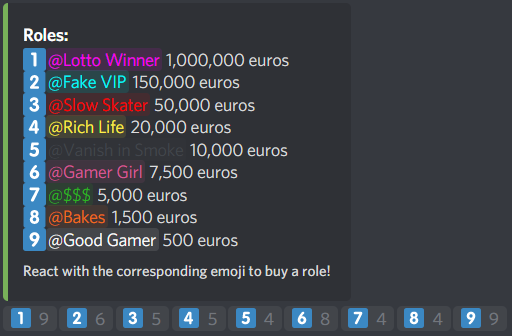

# ObliCogs
Custom made Cogs for [Red-DiscordBot V3](https://github.com/Cog-Creators/Red-DiscordBot/tree/V3/develop).
To add this repo to your instance please do: `[p]repo add ObliCogs https://github.com/Obliviatum/ObliCogs/`

## About Cogs
Once you have added ObliCogs to your instance you're free to install the following cogs.

### Matchmaking 🆕
> This cog allows members to ping other members for a certain game @role and limits the amount usage with a given cooldown.  
`[p]cog install ObliCogs matchmaking`  
> _Credits to **@XargsUK**_

### Roleshop 🚧
> This cog create a role shop message where members can react on to buy a role with there credits.  
`[p]cog install ObliCogs roleshop`  

Example Image
  

_🚧 Inconstruction | 🆕 New_
